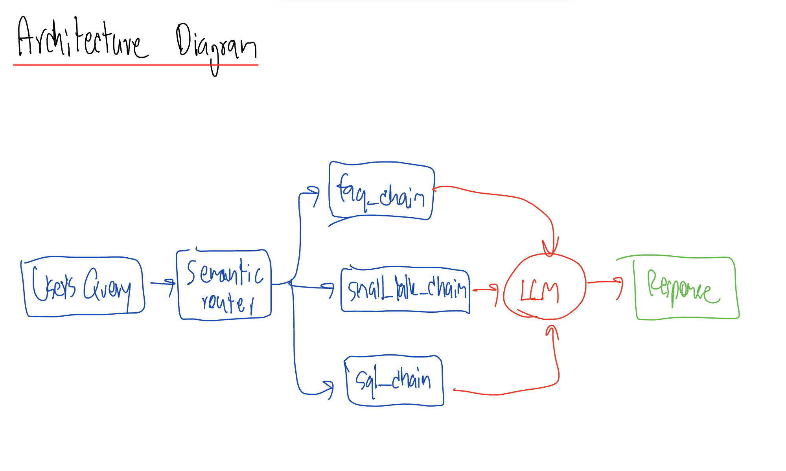
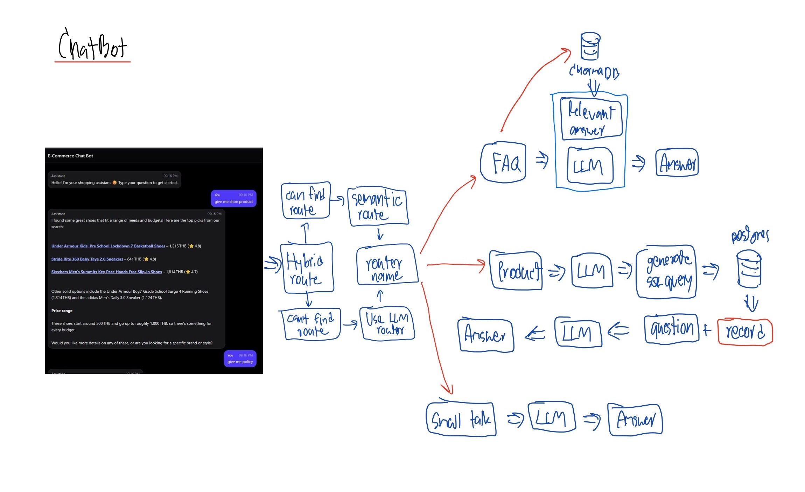
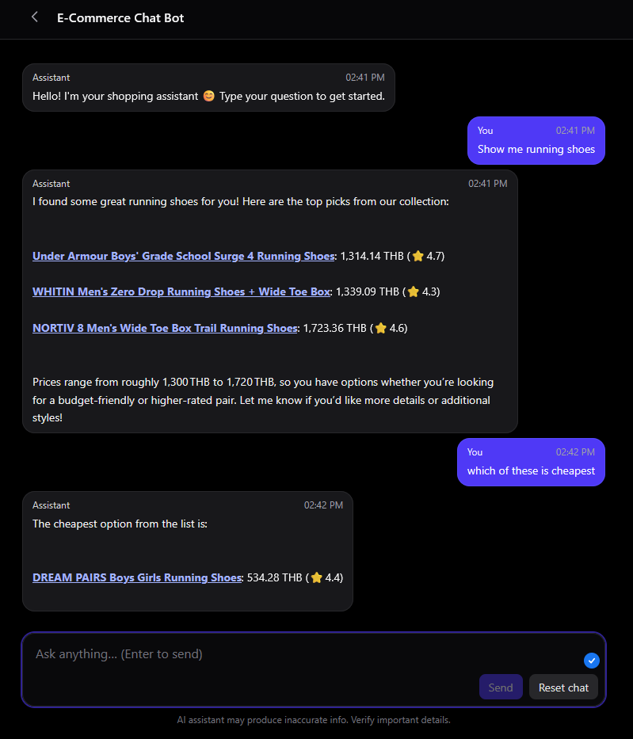

# E-commerce Chatbot

An intelligent E-commerce Chatbot designed to assist users with product queries, using RAG (Retrieval-Augmented Generation) and semantic routing for accurate and context-aware responses.

## System Architecture


*(High-level overview of the system components and data flow)*

## Chatbot Logic


*(Detailed flow of how the chatbot processes user queries using Semantic Router and RAG)*

## UI Preview


*(Screenshot of the React-based chat interface)*

## Features

-   **Intelligent Query Handling:** Uses Semantic Router to classify user intents (e.g., product search, small talk).
-   **RAG (Retrieval-Augmented Generation):** Retrieves relevant product information from ChromaDB to augment LLM code.
-   **Modern Tech Stack:** Built with Fast API for high performance and React for a responsive UI.
-   **Vector Search:** Utilizes `sentence-transformers` for efficient semantic search.

## Tech Stack

### Backend
-   **Language:** Python 3.13+
-   **Framework:** FastAPI
-   **Database:** ChromaDB (Vector DB), PostgreSQL (via SQLAlchemy)
-   **AI/ML:**
    -   `sentence-transformers` (Embeddings)
    -   `semantic-router` (Intent Classification)
    -   `groq` (LLM Inference)
-   **Dependency Management:** `uv`

### Frontend
-   **Framework:** React 19
-   **Build Tool:** Vite
-   **Styling:** TailwindCSS 4
-   **Language:** TypeScript

## Setup & Installation

### Prererequisites
-   Python 3.13 or higher
-   Node.js and npm
-   `uv` (for Python dependency management)

### 1. Backend Setup

Navigate to the backend directory:
```bash
cd backend
```

Install dependencies using `uv`:
```bash
uv sync
```

Set up environment variables:
Copy `.env.example` to `.env` and fill in the required API keys (e.g., GROQ_API_KEY, Database URL).
```bash
cp .env.example .env
```

Run the backend server:
```bash
# Using uv to run uvicorn
uv run uvicorn app.main:app --reload
```
The API will be available at `http://localhost:8000`.

### 2. Frontend Setup

Navigate to the frontend directory:
```bash
cd frontend
```

Install dependencies:
```bash
npm install
```

Run the development server:
```bash
npm run dev
```
The application will be running at `http://localhost:5173`.

## Usage
1.  Ensure both backend and frontend servers are running.
2.  Open your browser and navigate to the frontend URL.
3.  Start chatting with the bot! Try asking about products or general questions.
